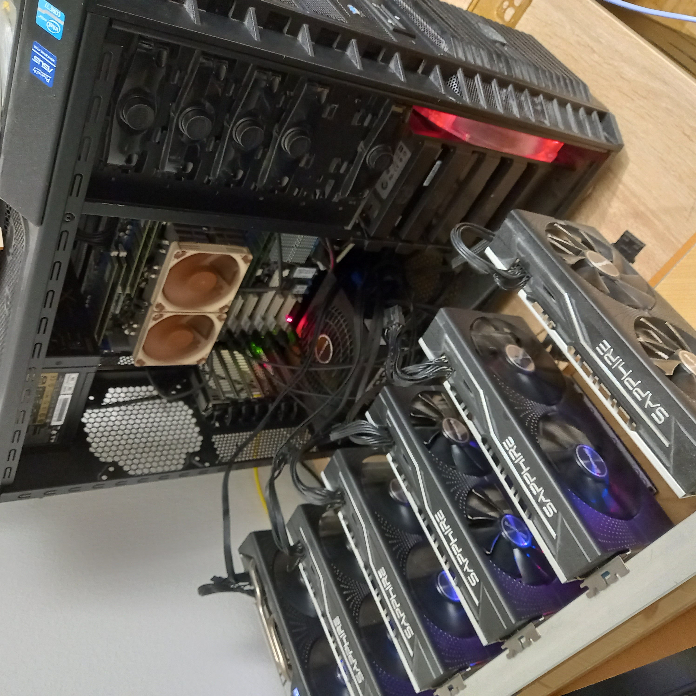

# 6× Polaris — Llama 3.3 70B Q4, split layer, ctx 25.6k TurboQuant-Vulkan

Runbook et scripts pour **Llama 3.3 70B Q4** sur **6 GPU AMD GCN Polaris** (Windows Vulkan), plus un correctif **optionnel** pour le cache KV TurboQuant (wave64).

> **Windows Vulkan only** — RX 570 / RX 580, `--split-mode layer`, contexte **25 600** tokens. Ce dépôt n’est **pas** un fork de llama.cpp : pas de binaire ni de poids GGUF.

**Périmètre :** `llama-server` (API OpenAI-compatible + interface web de chat).

Setup validé : **70B multi-GPU** sur 6× 8 Go (2026-08-31).



## Ce dépôt

```powershell
git clone https://github.com/gaigher/Polaris-multi-GPU-llama.git
cd Polaris-multi-GPU-llama
```

Les commandes ci-dessous s’exécutent **depuis la racine de ce clone**.

## Validé (2026-08-31)

| Plateforme     | Test                                         | Résultat |
| -------------- | -------------------------------------------- | -------- |
| **6× Polaris** | Llama 3.3 70B Q4, split layer, **ctx 25.6k** | **OK**   |

Chat API validé (`/v1/chat/completions`).

## Expérimental : GPT-OSS 120B

Scénario **MoE** (couches d’experts partielles GPU + `--moe-cache`) sur les mêmes 6× Polaris — **non validé** comme le 70B. Aide au placement : `scripts/placer_experts_incremental.ps1` (**expérimental**).

Détails, téléchargement Unsloth et commande de lancement : [docs/GPT-OSS_120B.md](docs/GPT-OSS_120B.md).

## Prérequis

- 6 cartes Polaris 8 Go (testé : 1× RX 570 + 5× RX 580)
- Pilotes AMD récents, Vulkan fonctionnel sous Windows
- Un GGUF **local** Llama 3.3 70B Instruct Q4 (ex. `Q4_K_M`, ~40 Go). Non fourni ici ; exemple : [bartowski/Llama-3.3-70B-Instruct-GGUF](https://huggingface.co/bartowski/Llama-3.3-70B-Instruct-GGUF) (`Llama-3.3-70B-Instruct-Q4_K_M.gguf`). Respecter la [licence Llama](https://www.llama.com/llama-downloads/)
- Un `llama-server` Vulkan (voir ci-dessous)

## Obtenir `llama-server`

Sans TurboQuant, n’importe quel `llama-server` Vulkan Windows suffit, par exemple :

- build officiel [ggml-org/llama.cpp](https://github.com/ggml-org/llama.cpp/releases) (zip Vulkan), ou
- build local [TheTom/llama-cpp-turboquant](https://github.com/TheTom/llama-cpp-turboquant) (nécessaire seulement pour `turbo3`).

Pointez ensuite la variable d’environnement vers le `.exe` réel (adaptez le chemin) :

```powershell
$env:SERVEUR_LLAMA = "C:\chemin\vers\llama-server.exe"
& $env:SERVEUR_LLAMA --list-devices
```

Le script `lancer_70b_6gpu.ps1` utilise `$env:SERVEUR_LLAMA` (sinon il cherche `%USERPROFILE%\Documents\llama-cpp-turboquant\build\bin\llama-server.exe`).

## Lancer le 70B (6 GPU)

### 1. Vérifier les périphériques Vulkan

Attendu (exemple) :

```
Vulkan0: Radeon RX 570 Series (8192 MiB, ...)
Vulkan1: Radeon RX 580 Series (8192 MiB, ...)
...
Vulkan5: Radeon RX 580 Series (8192 MiB, ...)
```

Notez les identifiants `Vulkan0` … `Vulkan5`. L’ordre peut varier selon les slots PCIe — adaptez `--device` si besoin.

### 2. Lancer le serveur (config validée)

Toujours depuis la racine de ce clone :

```powershell
$env:MODELE_LLAMA = "C:\chemin\vers\Llama-3.3-70B-Instruct-Q4_K_M.gguf"
# $env:SERVEUR_LLAMA déjà défini à l’étape précédente

.\scripts\lancer_70b_6gpu.ps1
```

Ou en une ligne :

```powershell
& $env:SERVEUR_LLAMA `
  -m $env:MODELE_LLAMA `
  --host 127.0.0.1 --port 8080 `
  -c 25600 -ngl 99 -fa on `
  --split-mode layer `
  --device Vulkan0,Vulkan1,Vulkan2,Vulkan3,Vulkan4,Vulkan5 `
  --fit off `
  -v --log-timestamps
```

#### Paramètres clés

| Option | Valeur | Rôle |
|--------|--------|------|
| `-c 25600` | ctx 25.6k | Fenêtre de contexte validée |
| `--split-mode layer` | layer | Répartit les 80 couches + KV sur les 6 GPU |
| `--device Vulkan0,…,Vulkan5` | 6 GPU | Tous les Polaris visibles par Vulkan |
| `--fit off` | pas d’ajustement auto | Évite que llama.cpp réduise le ctx silencieusement |
| `-ngl 99` | toutes les couches GPU | Indispensable pour le 70B |

### 3. Chat HTML et vérification

Une fois le serveur chargé, ouvrez dans le navigateur :

**[http://127.0.0.1:8080/](http://127.0.0.1:8080/)**

C’est l’interface web fournie par `llama-server` : conversation, paramètres, historique. Aucune UI supplémentaire à installer.

Test API rapide (sans navigateur) :

```powershell
Invoke-RestMethod -Uri "http://127.0.0.1:8080/health" -UseBasicParsing
$corps = '{"messages":[{"role":"user","content":"Bonjour"}],"max_tokens":64}'
Invoke-RestMethod -Uri "http://127.0.0.1:8080/v1/chat/completions" `
  -Method Post -ContentType "application/json" -Body $corps
```

Arrêt : **Ctrl+C** dans le terminal qui a lancé `llama-server`.

### 4. Mémoire / contexte

Le poids Q4 du 70B (~40 Go) est réparti sur les 6× 8 Go ; le KV s’ajoute par GPU selon les couches hébergées. Si OOM au chargement, réduire `-c` ou vérifier qu’aucune autre app utilise la VRAM.

## Optimisation optionnelle : TurboQuant

Pour gagner de la VRAM sur le cache KV (`turbo3`), un patch Polaris (wave64) et un build TheTom sont possibles. Ce n’est **pas** requis pour le 70B multi-GPU ci-dessus.

Sur Polaris, sans ce patch, `turbo3` provoque un `GGML_ASSERT` (subgroup 32 vs wave64).

- Patch, build et détails : [docs/TurboQuant_POLARIS.md](docs/TurboQuant_POLARIS.md)
- Lancement avec TurboQuant : `.\scripts\lancer_70b_6gpu.ps1 -TurboQuant`
- Contribution upstream : [docs/PR_UPSTREAM.md](docs/PR_UPSTREAM.md)

Exemple (après patch + build TheTom) :

```powershell
& $env:SERVEUR_LLAMA `
  -m $env:MODELE_LLAMA `
  --host 127.0.0.1 --port 8080 `
  -c 25600 -ngl 99 -fa on `
  --split-mode layer `
  --device Vulkan0,Vulkan1,Vulkan2,Vulkan3,Vulkan4,Vulkan5 `
  --cache-type-k q8_0 --cache-type-v turbo3 `
  --fit off `
  -v --log-timestamps
```

Mesure indicative (K `q8_0` / V `turbo3`, ctx 25.6k) :

```
llama_kv_cache: size = 2906.25 MiB ( 25600 cells,  80 layers,  1/1 seqs), K (q8_0): 2125.00 MiB, V (turbo3):  781.25 MiB
```

## Licence

MIT — voir [LICENSE](LICENSE) (texte anglais). Compatible avec llama.cpp / TheTom (MIT).

Les poids Llama 3.3 et GPT-OSS restent sous leurs licences respectives ; ils ne font pas partie de ce dépôt.
